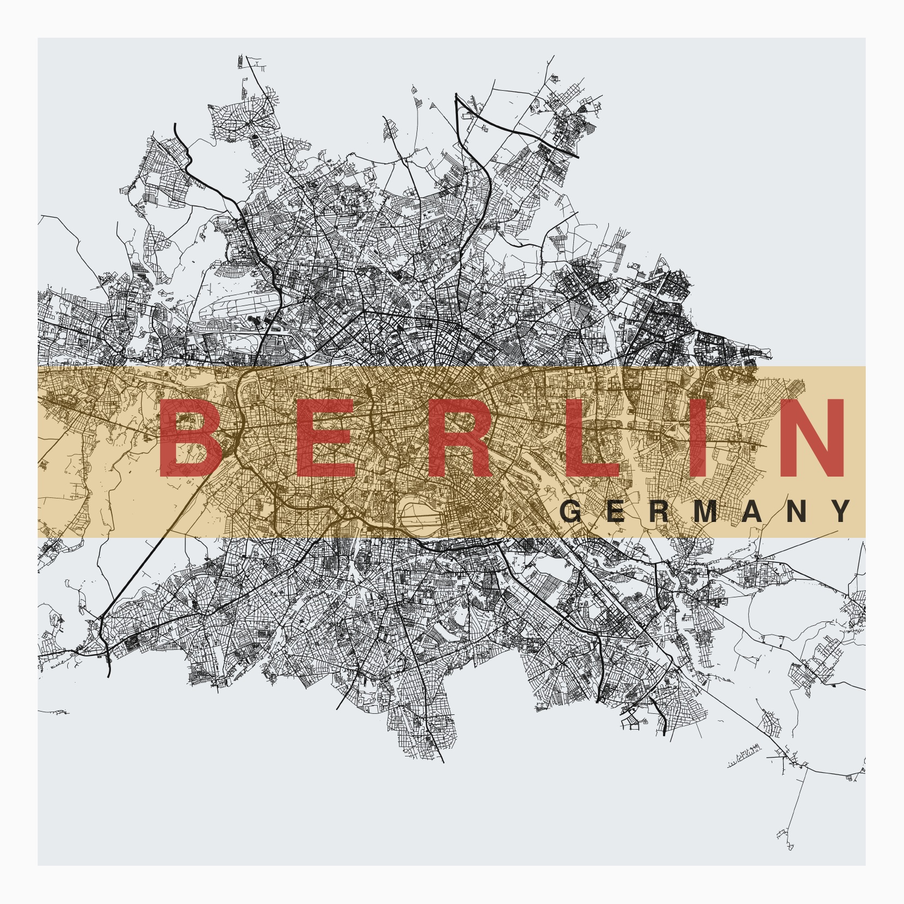

# Modern City Poster

An app to build a modern poster of your favorite city !

## Description

With this app, you can create nice poster of your favorite cities and personnalize the background, streets, fonts, margins, title and subtitle by modifying the :

- colors
- sizes
- transparencies
- fonts
- positions
- alignements
- charspace
- etc

Once created, you will have a png and a pdf version of your poster.

Here are some examples :

## Installation

Install the required packages :

``pip install -r requirements.txt``

## Usage

The creation of a poster from a new location can take a lot of time (more than 5 minutes). Take advantage of this time to get a coffee, look at the code, to improve it or to give me your feedback. After that first wait, you can edit all the settings (except location...) and get your poster in 5sec I promise ;) 

**Explanations** : for a new location, `osmnx` stores the data in the `cache` folder and this takes a lot of time. During this first build, a png file of the location is created. For the next calls, we only edit this picture to make the poster.

To summarize :

- edit the location : 5-10 minutes
- edit the other settings  : 5 seconds

### Terminal

To build your poster(s) from the terminal, run `python posters.py`. This command will build the posters of the description. Edit the `cities.py` to make yours !

### Streamlit

Easy ! Run the streamlit server with `streamlit run stream.py` from the `modern-city-poster` folder and edit the configuration in the sidebar. You can then download your poster as a pdf or a png file.

